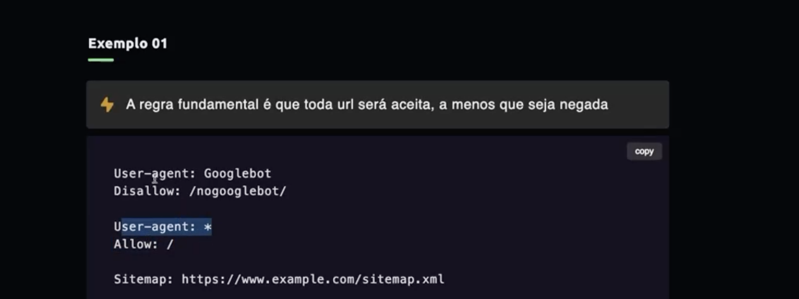

SEO

Posicionar pagina.
- [ ]    Crawling and indexing =>
- [ ]    Rendering => antes de renderizar  cmd + opt + u
- [ ]    URL => melhor usar siempre slugs, bloquear acceso a url complicadas, Se a pagina tiene un contenido infinito     
         como un calendario, adicionar el atributo no-follow a los links
- [ ]    Links => si el link no tiene contenido, usar title  // rel="nofollow"
- [ ]    siteMap => xml sitemaps.com
- [ ]    robots.txt => gerencia el crawling ->   
           permite acceso o niega acceso a ciertas rutas de los robots de búsqueda. retira archivos, no paginas
          // meta name = robots content="noindex"

- [ ]    Canocalization => decisión de google.
        redirects
        tag link cannonical href    
- [ ]    redirects => meta http-equiv= refresh content= 0; newUrl // buscar por 301 redirects 
- [ ]    Structures data =>, (Local Business)

    herramientas => schema.org, webcodetools, search.google.com /test/ rich-results

- [ ]    sitelinks => proceso automatico 
- [ ]    metatags =>  google search console ej robot noindex, nofollow, desccription

description => google serp simulator

- [ ]    Open Graph => 4 fundmentales og  
    webcode.tools. opengraph generator

- [ ]    Navegacao =>

        // dados estructurados breadcrumbs
        // 404 tiene que redireccionar a navegación

- [ ]    Images => 
- [ ]    Search console google => 

